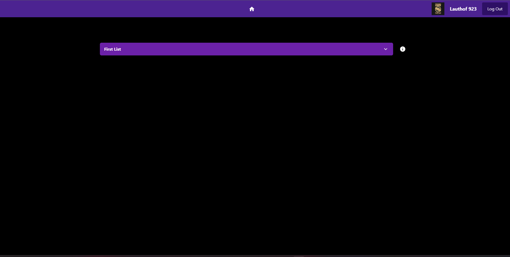
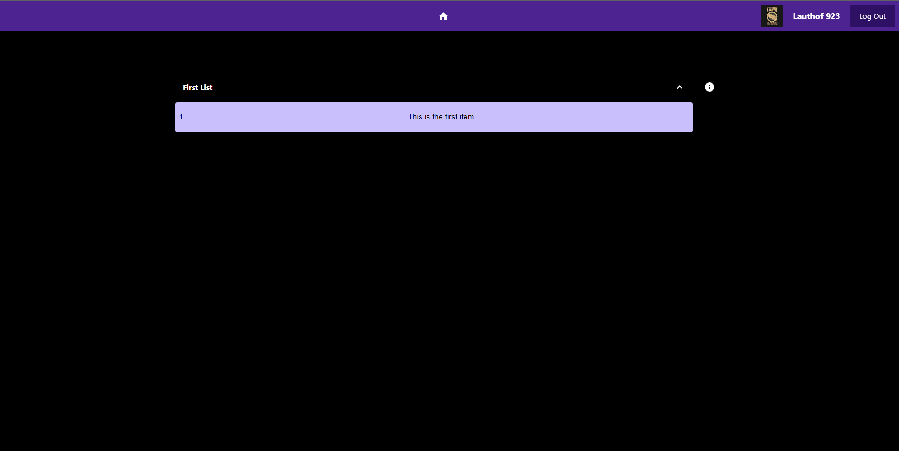
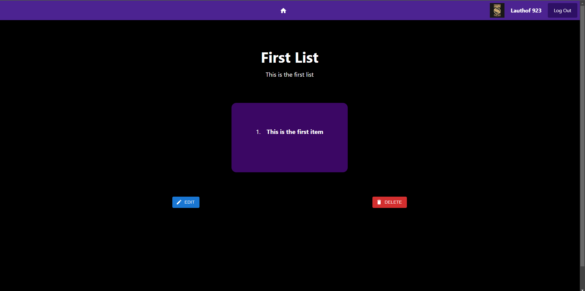

# Todo-List

***Work in progress***

## How to run

First run `npm install`, then run `npm run dev`

## What is it?

A simple todolist website created using nextjs, prisma and mysql. Styling is done with tailwindcss and Material UI. Auth0 provides authentication and authorization.

Log in and create a todo list, or view your existing todo lists.

## Why?

To learn how nextjs works.

## Some pictures

## Work in progress

- More styling
- add functionality to edit and delete button when viewing a specific list
- remove html Modal and add MUI modal

## Future features

- Edit or remove todo's
- Set certain items in a todo to DONE
- Define and adjust deadlines for a todolist
- Send notifications (through mail?) when a deadline is near (about a week before deadline).
- Show todolists instead of home screen when token is valid on opening website.
  