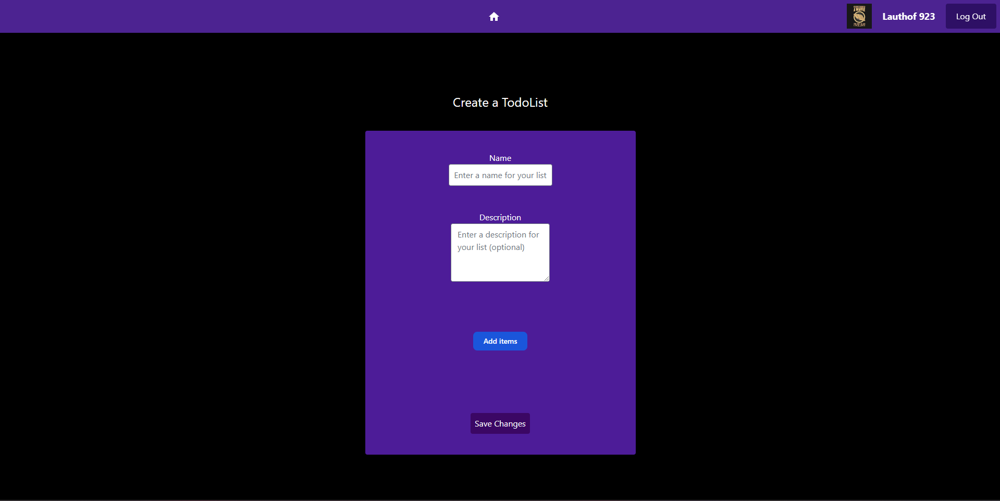

# Todo-List

***Work in progress***

## How to run

First run `npm install`, then run `npm run dev`

## What is it?

A simple todolist website created using nextjs. Styling is done with tailwindcss.

Log in and create a todo list, or view your existing todo lists.

## Why?

To learn how nextjs works.

## Some pictures

## Work in progress

- Currently api routes are done with a separate backend using koajs. This will be removed and api routes will be done according to nextjs documentation, in the frontend.
- Login and logout is possible but no routes are authentication protected yet.
- There is currently no connection to the database, so you can not actually create or view todo's.
- The screen for viewing your todo's is not fully implemented yet.

## Future features

- Edit or remove todo's
- Set certain items in a todo to DONE
- Define and adjust deadlines for a todolist
- Send notifications (through mail?) when a deadline is near (about a week before deadline).
- Show todolists instead of home screen when token is valid on opening website.
  